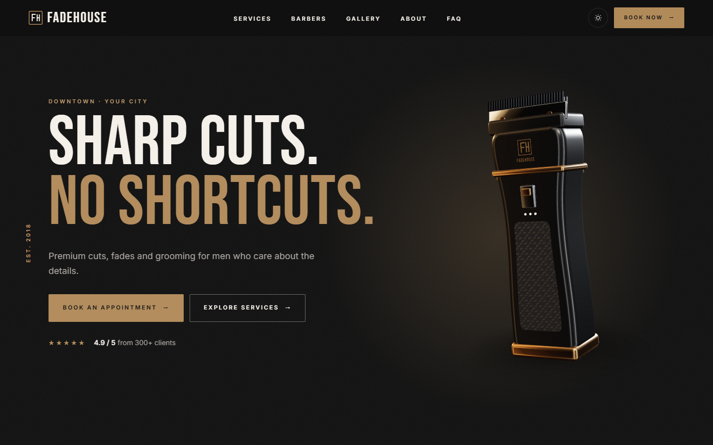
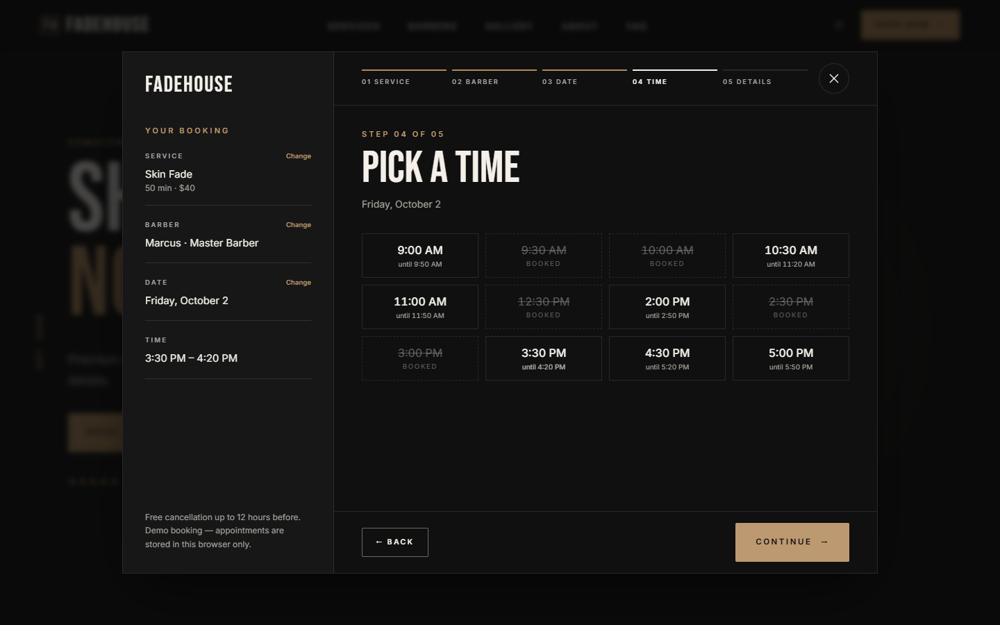
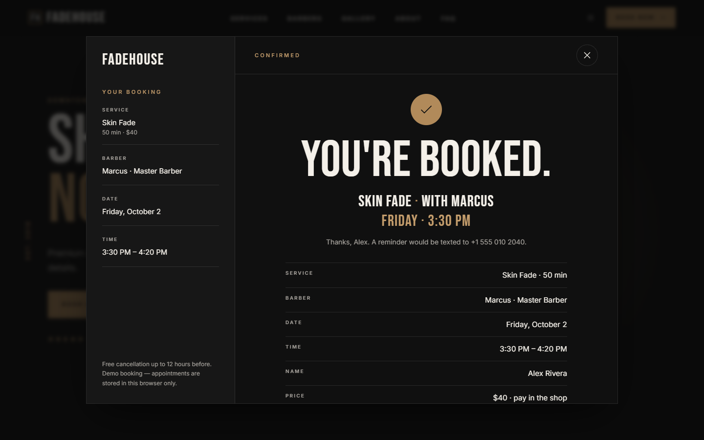
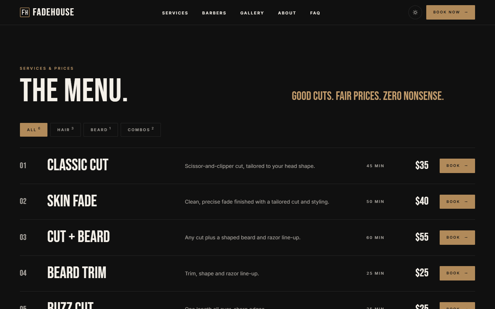
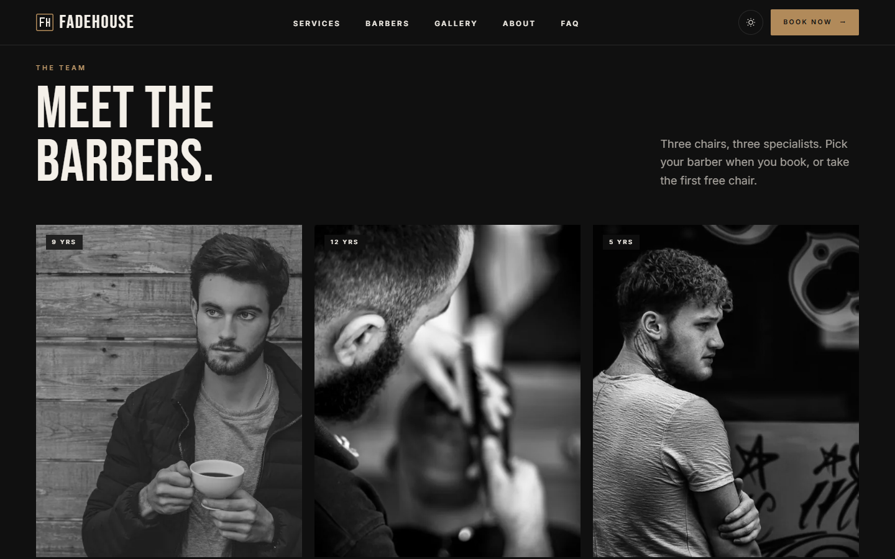
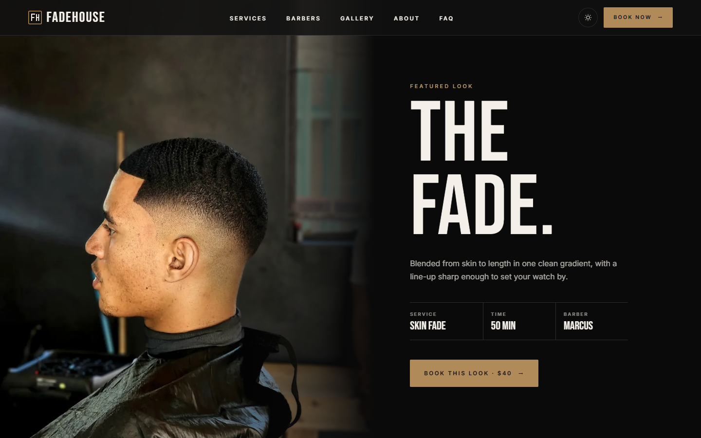
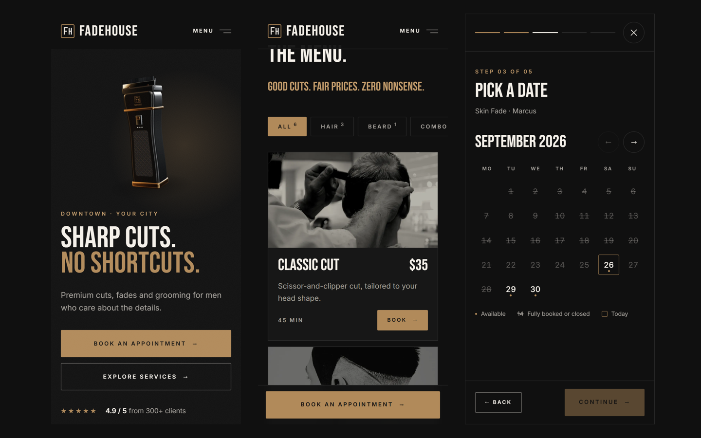
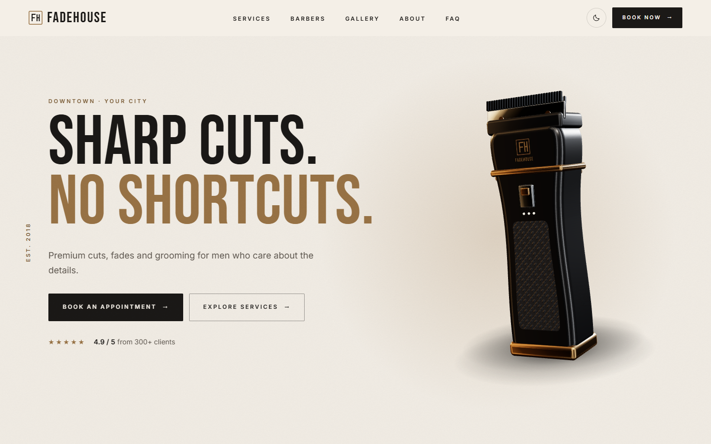

# FADEHOUSE — Premium Barbershop Booking Website Template

A dark, premium barbershop website **template** with a **real, working booking flow** and a 3D hair clipper built in code. Made for small and independent barbershops: a visitor can book a cut in 30–60 seconds.

**Live demo:** https://fadehouse-muad1.vercel.app
**Get the source:** https://muadme.gumroad.com/l/jyhztr

## Highlights

- **Booking in 6 steps**: service → barber → date → time → details → "YOU'RE BOOKED."
  - Only name + phone required. Opening hours are respected and double bookings blocked.
  - Confirmation with Google Calendar, Apple/Outlook (.ics), directions and a pre-filled WhatsApp message.
  - The UI talks to just two functions, so connecting Supabase, Firebase, your own API, Calendly or Google Calendar is one file.
- **3D clipper built in code**: no third-party model to license. It turns gently with scroll and leans toward the cursor; it never spins on its own.
- **Never an empty box**: live WebGL on desktop; transparent pre-rendered stills on phones, weak devices, browsers without WebGL and for reduced-motion users.
- **Everything a barbershop site needs**:
  - filterable menu with service modals
  - featured look ("THE FADE.")
  - barber profiles ("Book with James" preselects him)
  - masonry gallery with lightbox
  - before/after slider
  - membership ("FADEHOUSE CLUB")
  - reviews carousel with a Google-style rating badge
  - location with a lazy map
  - FAQ
  - Instagram grid
- **Mobile-first**: rebuilt layouts, full-screen booking with a sticky Continue button, sticky Book + WhatsApp bar.
- **Dark by default** with a warm light mode, plus `BarberShop` + services + FAQ structured data.
- **Lighthouse**: mobile 96 · 100 · 100 · 100, desktop 100 · 100 · 100 · 100.
- **Rebrand from config**: brand, services, prices, barbers, hours, WhatsApp and Instagram live in a few documented files.

## Stack

React 19 · TypeScript · Vite · Tailwind CSS v4 · three.js / React Three Fiber + Drei

## Gallery

| | |
|---|---|
|  |  |
|  |  |
|  |  |
|  | |

## This repository

This repo is a **showcase**: screenshots and a live demo link, not the source. The full source, with the setup guide, customisation guide and booking-backend guide, is sold on Gumroad:
**https://muadme.gumroad.com/l/jyhztr**

Demo content (shop, prices, reviews, barbers, availability) is fictional. Demo photography is CC0.

## More templates

- [PROOF](https://github.com/Muaddd1/PROOF) — AI performance and outcome SaaS template with AI task replays, missions, a transparent ROI center and an approval center ([demo](https://proof-muad1.vercel.app))
- [SYNTRA](https://github.com/Muaddd1/SYNTRA) — AI business command center SaaS template with an AI command palette, an approval queue with audit log, a visual workflow builder and five AI agents ([demo](https://syntra-muad1.vercel.app))
- [VANTA DETAIL](https://github.com/Muaddd1/VANTA-DETAIL) — automotive detailing template with a scroll-driven 3D car, a live quote builder and a seven-step booking flow ([demo](https://vanta-detail-muad1.vercel.app))
- [NEXFORM](https://github.com/Muaddd1/NEXFORM) — futuristic personal-trainer template with a 3D athlete, a quiz, a body map and a real booking flow ([demo](https://nexform-muad1.vercel.app))
- [ÉLORA](https://github.com/Muaddd1/ELORA) — luxury beauty salon template with a real booking flow ([demo](https://elora-muad1.vercel.app))
- [VELLUTO](https://github.com/Muaddd1/VELLUTO) — cinematic 3D coffee-brand template ([demo](https://velluto-muad1.vercel.app))
- [AURELIA](https://github.com/Muaddd1/AURELIA) — luxury e-commerce React template ([demo](https://aurelia-template-phi.vercel.app))
- [GOLDEN CRUST](https://github.com/Muaddd1/GOLDEN-CRUST) — pizza restaurant template with a 3D pizza hero ([demo](https://golden-crust-muad1.vercel.app))
- [AURUM](https://github.com/Muaddd1/AURUM) — luxury gold jewelry template with a live gold price calculator and Arabic RTL ([demo](https://aurum-template-muad1.vercel.app))
- [VANTA](https://github.com/Muaddd1/VANTA) — premium digital-product storefront ([demo](https://vanta-creator-os.vercel.app))
- [PLINTH](https://github.com/Muaddd1/PLINTH) — interior design studio template in a single HTML file ([demo](https://plinth-template.vercel.app))

## Author

Built by [Mouad Sehli](https://muad-portfolio.vercel.app), freelance front-end developer (React, TypeScript, Tailwind). More work and contact details are on the [portfolio](https://muad-portfolio.vercel.app).
